<div align="center">

<p align="center">
  <picture>
    <source media="(prefers-color-scheme: dark)" srcset="docs/diagrams/logo-dark.png">
    <source media="(prefers-color-scheme: light)" srcset="docs/diagrams/logo.png">
    
  </picture>
</p>

### **Submit it once. Never lose it.**
### Priority-scheduled, crash-recovering job execution for Go, with a dashboard in the binary.

---
<br/>

**kairos** is a **distributed job processor** for Go: submit work over HTTP, let it be ranked by priority and age, dispatched through Redis, and executed by worker processes you write yourself. Every state transition, retry deadline and redelivery decision is recorded in PostgreSQL.

Unlike queue libraries that keep redelivery authority in the broker, **kairos** keeps it in Postgres. Redis holds job ids and nothing else, so flushing it costs a dispatch-latency hit rather than durable state. Crash recovery, elapsed backoff, an unclaimed dispatch and a brand-new job are all the *same* condition, `next_check_at` in the past, so there is no recovery daemon anywhere in this codebase.

<br/>


<br/>
</div>

---
<br/>

<p align="center">
  
  
  
  
  
  
</p>

## Table of contents

- [What it is](#what-it-is)
- [Features](#features)
- [How it compares](#how-it-compares)
- [Architecture](#architecture)
- [Dispatch and recovery are the same query](#dispatch-and-recovery-are-the-same-query)
- [Job states and attempt outcomes](#job-states-and-attempt-outcomes)
- [Getting started](#getting-started)
- [Using kairos as a library](#using-kairos-as-a-library)
  - [A complete worker](#a-complete-worker)
  - [The handler contract](#the-handler-contract)
  - [Library configuration](#library-configuration)
- [Submitting jobs](#submitting-jobs)
- [HTTP API](#http-api)
- [Guarantees](#guarantees)
- [Scheduling: priority and aging](#scheduling-priority-and-aging)
- [Failure handling](#failure-handling)
- [Dashboard](#dashboard)
- [Scaling](#scaling)
- [Roadmap](#roadmap)
- [Known limitations](#known-limitations)
- [Gotchas](#gotchas)
- [Setup, configuration and deployment](docs/SETUP.md)
- [License](#license)

## What it is

kairos is a distributed job execution platform for Go. You hand it a unit of work, it decides
when that work runs and on which machine, it executes it, and it keeps executing it until the
work either succeeds or is declared dead. Every one of those decisions is recorded, so at any
point you can answer what ran, where, how many times, and why it failed.

**Execution** is distributed across as many worker processes as you start, on as many machines as
you like. Work is ranked by priority and by how long it has been waiting, so urgent jobs go first
without ordinary jobs waiting forever behind them. Each worker runs a bounded number of jobs at
once and takes work from the queues you tell it to serve.

**Error handling** is what happens when your code returns an error. The attempt is recorded with
whatever the handler returned, the job goes back to waiting with an exponential backoff and full
jitter, and it is tried again. A handler that panics is recovered into a failed attempt with a
stack trace instead of taking the worker process down. Once a job has used its retries it moves
to a terminal `dead` state, where it stays visible and can be rerun by an operator.

**Failure handling** is what happens when things outside your code break. A worker that is killed
mid-job stops sending heartbeats, and its work becomes due again automatically and is picked up
elsewhere. A job dispatched but never claimed comes back on its own. Losing Redis entirely costs
dispatch latency and nothing else, because no durable state lives there. A job that repeatedly
kills the workers that touch it is capped and stops being redelivered.

**At-least-once execution** is the guarantee. A job that is accepted runs one or more times, and
is never silently dropped. The cost of that guarantee is that a handler can run twice, most often
when a worker dies after finishing the work but before recording that it did. Handlers must
therefore be idempotent. That is a real obligation on the task author, and no job system can
remove it.

### How it runs

kairos runs as three processes. Two ship in this repo; the third is **your** binary.

| Process | What it does |
| --- | --- |
| **api** (`cmd/api`) | HTTP API for submitting and inspecting jobs, plus the embedded dashboard |
| **consumer** (`cmd/consumer`) | Polls Postgres for due work, pushes ids to Redis, reclaims stuck jobs |
| **worker** (your binary) | Imports the `kairos` package, registers handlers by name, executes jobs |

There is no generic worker binary. Handlers are Go functions in your application, and the
handler map is the contract between whoever submits jobs and whoever runs them.

## Features

**Scheduling**

- Per-job priority, `1` (highest) through `10` (lowest), combined with an aging term so older work is not starved indefinitely
- Adhoc jobs (run once, as soon as they are picked up) and cron jobs (recurring, 5-field UTC expressions, optional `starts_at` / `ends_at` window)
- A closed set of queues declared in `consumer.yaml`: submitting to an undeclared queue is a validation error, not a silently created queue
- Per-queue dispatch windowing: at most `queue_limit` jobs in flight toward a queue per poll

**Execution**

- Bounded worker concurrency, configurable per worker process
- `priority` or `round_robin` ordering across the queues one worker serves
- A panicking handler produces a failed attempt with a captured stack trace, not a dead worker process
- The handler's `context` is cancelled the instant its claim is lost, so a slow handler stops instead of double-executing
- Graceful drain on shutdown with a hard `shutdown_grace` deadline

**Reliability**

- Idempotency through an `Idempotency-Key` header, enforced by a unique constraint rather than a read-then-write check
- Optimistic concurrency: every mutation is guarded on the `version` the caller last read, so a stale write becomes a `409` rather than a silent overwrite
- Jittered exponential backoff on failure, capped, until `max_retries` is exhausted
- Task-level heartbeats; crash recovery and lost-dispatch recovery both fall out of the ordinary due-jobs poll
- Two independent counters: `retry_count` for handler-signalled failure, `delivery_count` for every hand-off including silent crashes

**Observability**

- Per-attempt execution history: who ran it, when, what it returned, why it failed
- Per-attempt job logs, buffered in the worker and batch-inserted into a range-partitioned Postgres table
- A live worker registry in Redis with self-expiring keys, so the list is current by construction rather than by reaping
- A dashboard embedded in the `api` binary with `go:embed`: no build step, no CDN, no network access at runtime

## How it compares

Against three widely used Go job and scheduling libraries. Every row below was checked against
each project's own documentation or source; anything their docs do not state is marked
*not documented* rather than guessed.

| | kairos | [asynq](https://github.com/hibiken/asynq) | [Machinery](https://github.com/RichardKnop/machinery) | [go-quartz](https://github.com/reugn/go-quartz) |
|---|---|---|---|---|
| **Job state store** | PostgreSQL | Redis | result backend (Redis, Mongo, AMQP, DynamoDB, Memcache) | in-memory |
| **Broker** | Redis, disposable | Redis | AMQP / Redis / SQS / Pub-Sub | none |
| **Per-job priority** | ✓ `1` to `10` | ✗, weighted or strict priority **per queue** | not documented | ✗ |
| **Anti-starvation aging** | ✓ | ✗ | ✗ | ✗ |
| **Retries with backoff** | ✓ exponential, full jitter | ✓ | ✓ Fibonacci spacing | ✗ |
| **Dead-letter / archive** | ✓ `dead` state with operator rerun | ✓ archived tasks, kept for inspection | not documented | ✗ |
| **Crash recovery** | ✓ heartbeat, through the dispatch query | ✓ automatic after a worker crash | broker-dependent | ✗ |
| **Cron / periodic jobs** | ✓ | ✓ | ✓ | ✓ |
| **Duplicate-submit suppression** | ✓ `Idempotency-Key` header | ✓ unique option | not documented | ✗ |
| **Per-attempt history retained** | ✓ `job_attempts` plus per-attempt logs | ✗ | ✗ | ✗ |
| **Web console** | ✓ embedded in the `api` binary | ✓ asynqmon, separate binary | ✗ | ✗ |
| **Workflows / DAG** | ✗ | ✗ | ✓ chains, groups, chords | ✗ |
| **Task aggregation / batching** | ✗ | ✓ | ✗ | ✗ |
| **Operational weight** | Postgres + Redis | Redis | broker + result backend | none, single process |

Where kairos is different: per-job priority that ages, so a low-priority job has a bound on how
long it can sit behind higher-priority work, and a single Postgres query that covers new work,
elapsed backoff, a due cron fire, a crashed worker and an unclaimed dispatch.

Where the others are ahead: asynq and Machinery are mature, widely deployed and well tested.
kairos has no automated test suite yet and has not been run in production. Machinery also covers
workflow shapes kairos has no answer for.

Reach for **asynq** if Redis is already your only datastore and per-queue weighting is enough.
**Machinery** if you need chains, groups and chords over an existing broker.
**go-quartz** if you want in-process cron with no infrastructure at all.

## Architecture

<picture>
  <source media="(prefers-color-scheme: dark)" srcset="docs/diagrams/architecture-dark.png">
  <source media="(prefers-color-scheme: light)" srcset="docs/diagrams/architecture.png">
  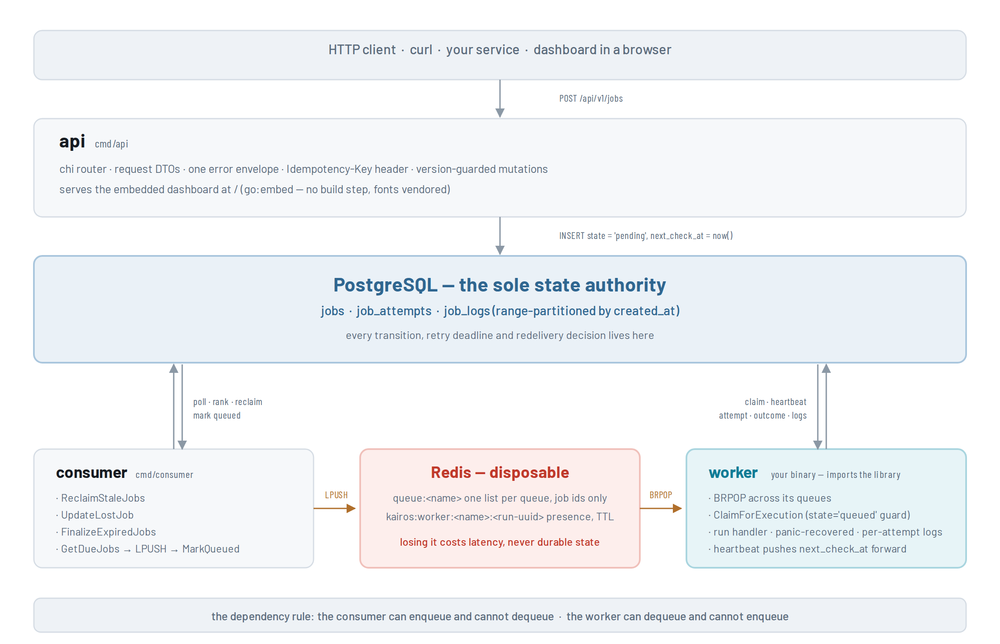
</picture>

| Package | Owns |
| --- | --- |
| `internal/api` | HTTP handlers, request/response DTOs, error mapping |
| `internal/job` | Job lifecycle repository: every state transition, Postgres only, never touches Redis |
| `internal/worker` | Execution, heartbeats, log sink, worker registry |
| `internal/consumer` | The polling dispatcher: due-job selection, Redis push, stale-job reclaim |
| `internal/config` | `.env` and `consumer.yaml` loading and validation |
| `internal/db` | sqlc-generated query code, connection pool, migrations |
| `internal/dashboard` | Embedded UI assets plus a read-only repository composing Postgres and Redis |
| `internal/cron` | Cron expression validation and next-run computation (wraps `robfig/cron`) |
| `internal/queue` | Redis queue key naming |
| `internal/logging` | Logger setup |

The dividing line: anything that transitions a job's state lives in
`internal/job` and is Postgres-only. Anything the dashboard reads lives in
`internal/dashboard` and may compose both stores. The consumer can enqueue and cannot
dequeue; the worker can dequeue and cannot enqueue.

**What lives in Redis.** One list per queue, `queue:<name>`, holding job ids and no payloads.
Worker presence at `kairos:worker:<name>:<run-uuid>` with a TTL. `<name>` comes from the
required `-name` flag and survives restarts; the run uuid is fresh per process, so the pair
identifies one live worker instance, and that same string lands in `job_attempts.worker_id`.

## Dispatch and recovery are the same query

<picture>
  <source media="(prefers-color-scheme: dark)" srcset="docs/diagrams/job-flow-dark.png">
  <source media="(prefers-color-scheme: light)" srcset="docs/diagrams/job-flow.png">
  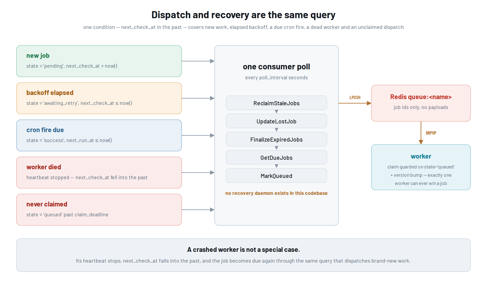
</picture>

A running job pushes `next_check_at` forward on a heartbeat. If the worker dies, the pushes
stop, the deadline falls into the past, and the job becomes due again, through the same
query that dispatches brand-new work. Recovery falls out of how due-ness is defined rather
than being implemented separately.

## Job states and attempt outcomes

<picture>
  <source media="(prefers-color-scheme: dark)" srcset="docs/diagrams/states-dark.png">
  <source media="(prefers-color-scheme: light)" srcset="docs/diagrams/states.png">
  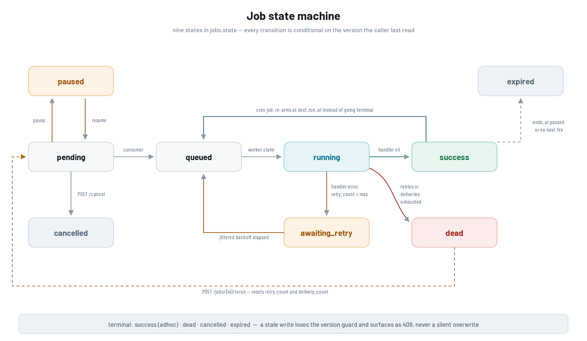
</picture>

A job (`jobs.state`) is one of:

| State | Meaning |
| --- | --- |
| `pending` | Accepted, not yet dispatched to Redis |
| `queued` | Pushed to Redis, not yet claimed by a worker |
| `running` | Claimed by a worker, executing |
| `awaiting_retry` | A handler failed; waiting out backoff before becoming due again |
| `success` | Terminal for an adhoc job; a cron job instead re-arms at `next_run_at` |
| `dead` | Terminal: `retry_count` reached `max_retries`, or delivery attempts were exhausted |
| `cancelled` | Terminal: cancelled through the API |
| `expired` | Terminal: `ends_at` passed, or a cron schedule has no fire left |
| `paused` | Cron jobs only, via `POST /pause`; back to `pending` when unpaused |

An individual execution attempt (`job_attempts.outcome`) is one of:

| Outcome | Meaning |
| --- | --- |
| `in_progress` | Attempt open, a worker is executing it |
| `success` | The handler returned `nil` |
| `failed` | The handler returned an error, or panicked |
| `cancelled` | The worker lost its claim mid-flight and closed its own attempt |
| `superseded` | The worker went silent; the consumer closed the attempt during reclaim |
| `lost` | Dispatched to Redis but never claimed before `claim_deadline` |

The database enforces the same invariants independently: a check constraint ties every
terminal state to a null `next_check_at`, priority to `1..10`, and `cron_expr` to
`job_type = 'cron'`.

## Getting started

```bash
docker compose up -d --build
```

That starts Postgres and Redis, runs the migration, and brings up `api` and `consumer`. The
dashboard is then at **<http://localhost:8000>**.

Full instructions live in **[docs/SETUP.md](docs/SETUP.md)**: prerequisites, installing the
library, submitting a first job, every configuration file, Docker deployment and the development
loop.

## Using kairos as a library

### A complete worker

```go
package main

import (
	"context"
	"encoding/json"
	"fmt"
	"os"
	"os/signal"
	"syscall"
	"time"

	"github.com/amoghar29/kairos"
)

func main() {
	ctx, stop := signal.NotifyContext(context.Background(), os.Interrupt, syscall.SIGTERM)
	defer stop()

	k, err := kairos.New(ctx, kairos.Config{
		PostgresCfg: kairos.PostgresConfig{DSN: os.Getenv("DBDSN")},
		RedisCfg:    kairos.RedisConfig{Addr: "localhost:6379"},
	})
	if err != nil {
		panic(err)
	}
	defer k.Close()

	if err := k.AddHandler("email.send", sendEmail); err != nil {
		panic(err)
	}

	opts, err := kairos.OptionsFromArgs("worker", os.Args[1:])
	if err != nil {
		panic(err)
	}
	if err := k.Run(ctx, opts); err != nil {
		panic(err)
	}
}

func sendEmail(ctx context.Context, j kairos.Job) (string, error) {
	var payload struct {
		To string `json:"to"`
	}
	if err := json.Unmarshal(j.Payload, &payload); err != nil {
		return "", fmt.Errorf("bad payload for email.send: %w", err)
	}

	j.Logs.Log("info", "connecting to smtp relay")

	select {
	case <-ctx.Done():
		return "", ctx.Err()
	case <-time.After(400 * time.Millisecond):
	}

	return "delivered to " + payload.To, nil
}
```

```bash
go run . -name worker-1 -queue default -concurrency 3        # worker package in the current directory
go run ./cmd/worker -name worker-1 -queue default            # or wherever it lives in your module
```

| Flag | Required | Notes |
| --- | --- | --- |
| `-name` | yes | Worker name shown in the registry. No `:` and no whitespace, since it is half of `kairos:worker:<name>:<run-uuid>`. Reused across restarts. |
| `-queue` | yes | Queue to serve. Repeat the flag for more, in order. Each must be declared in `consumer.yaml`, and duplicates are rejected. |
| `-concurrency` | no | Max jobs run at once. Omit it, or pass `0`, to use `concurrency` from the worker config file. |

`-queue` order matters: with `queue_strategy: priority` earlier queues always win, with
`round_robin` (the shipped default) they take equal turns.

Scale out by starting more processes with different `-name` values. There is no registration step.

### The handler contract

```go
type HandlerFunc func(ctx context.Context, j kairos.Job) (string, error)

type Job struct {
	ID         uuid.UUID
	Name       string
	Queue      string
	Handler    string
	Payload    []byte     // raw JSON exactly as submitted
	RetryCount int32
	MaxRetries int32
	Logs       *JobLogger // Log(level, line); persisted per attempt
}
```

- **The returned string** is stored as the attempt's result and is visible through the API and the dashboard.
- **A returned error** fails the attempt: the job goes to `awaiting_retry` with jittered exponential backoff, or to `dead` once `retry_count` reaches `max_retries`.
- **A panic** is recovered and recorded as a failure with a stack trace. It does not take down the worker process.
- **`j.Logs.Log(level, line)`** buffers into a sink flushed on an interval and a threshold, then batch-inserted into `job_logs`. Levels: `debug`, `info`, `warning`, `error`, `fatal`; anything else is recorded as `info`.
- **An unregistered handler name** fails every attempt and lands the job in `dead`. This is deliberate: the API has no knowledge of what handlers exist, so it cannot validate the name at submission.
- **Handlers must respect `ctx`.** It is cancelled the instant a claim is lost to another worker; a handler that ignores it keeps working on a job it no longer owns.

Handler idempotency is the task author's responsibility. kairos guarantees at-least-once
delivery and cannot make a handler safe to run twice.

### Library configuration

```go
type Config struct {
	RedisCfg         RedisConfig
	PostgresCfg      PostgresConfig
	WorkerConfigPath string       // empty = embedded defaults (internal/worker/default.yaml)
	Logger           *slog.Logger // nil = slog.Default()
}
```

Only `PostgresCfg.DSN` is required. `kairos.New` fills the rest: Postgres pool `MaxConns` 10 /
`MinConns` 2 / lifetime 1h / idle 30m / health check 1m, and Redis `localhost:6379` on RESP 3.

This default-filling is specific to the library's `Config`. It does **not** apply to `cmd/api`
or `cmd/consumer`, which read every Postgres and Redis setting from an environment variable and
refuse to start if one is missing.

`WorkerConfigPath` is optional. Leaving it empty uses the tuning values embedded at
`internal/worker/default.yaml`, so an importing application does not have to vendor a copy of
`worker.yaml` and re-vendor it every time a key is added. Point it at a file to override; the
file must be complete, since it is not merged over the defaults and every key is validated on
load. The full key list and its validation rules are in
[docs/SETUP.md](docs/SETUP.md#workeryaml).

## Submitting jobs

| Field | Required | Notes |
| --- | --- | --- |
| `name` | yes | ≤ 200 chars |
| `queue` | yes | must be declared in `consumer.yaml` |
| `handler` | yes | ≤ 200 chars, must match an `AddHandler` name |
| `payload` | no | any JSON; defaults to `{}` |
| `priority` | no | 1 (highest) to 10 (lowest), default 5 |
| `max_retries` | no | 0 to 25, default 3 |
| `cron` | no | 5-field UTC cron expression; makes the job recurring |
| `starts_at` | no | **required alongside `cron`**; must be in the future |
| `ends_at` | no | must be after `starts_at`; the job or schedule expires past it |

Unknown body fields are rejected with `400`, so a stray key is caught rather than silently
ignored. The request body is capped at 1 MiB.

**Idempotency is a header, not a field.** Send `Idempotency-Key: <≤255 chars>`; resubmitting
with the same key returns `200` and the existing job instead of creating a second one,
regardless of what the rest of the body says. A brand-new job returns `201`.

A job is either **adhoc** (the default, runs as soon as a worker picks it up; `starts_at`
without `cron` is rejected) or **recurring** (`cron` set). A successful cron occurrence re-arms
the same row to `pending` at the next fire time rather than going terminal, so one `jobs` row
*is* the schedule and its `job_attempts` rows are its run history.

## HTTP API

Everything lives under `/api/v1`. Every other path is the dashboard.

| Method | Path | Purpose |
| --- | --- | --- |
| `GET` | `/healthz` | liveness |
| `POST` | `/jobs` | submit: `201` new, `200` idempotent hit |
| `GET` | `/jobs` | list and filter |
| `GET` | `/jobs/{id}` | fetch one |
| `DELETE` | `/jobs/{id}` | delete |
| `POST` | `/jobs/{id}/cancel` | only `pending` / `queued` / `awaiting_retry` / `paused`, or a re-arming cron row |
| `POST` | `/jobs/{id}/rerun` | only `dead`, and only inside `ends_at`; resets `retry_count` and `delivery_count` |
| `POST` | `/jobs/{id}/pause` | body `{"version": n, "paused": true\|false}`, **cron jobs only** |
| `POST` | `/jobs/{id}/schedule` | replace `cron` / `starts_at` / `ends_at` (alias: `/reschedule`) |
| `GET` | `/jobs/attempts` | every attempt across all jobs, newest first; filter by `outcome`, `handler`, `queue` |
| `GET` | `/jobs/{id}/attempts` | execution history for one job, oldest first |
| `GET` | `/jobs/{id}/attempts/{attemptID}/logs` | log lines for one attempt |
| `GET` | `/queues` | per-queue state counts and live Redis depth |
| `GET` | `/workers` | live worker registry, read from Redis |
| `GET` | `/handlers` | per-handler counts plus which live workers serve them |
| `GET` | `/handlers/{name}` | one handler plus its recent jobs |

**Every mutation carries the job's current `version` in the body** and returns `409` if the row
moved underneath you. That is the whole concurrency story; there are no locks.

`GET /jobs` filters, all optional and combinable:

| Param | Notes |
| --- | --- |
| `state` | repeatable, OR-matched: `?state=dead&state=cancelled` |
| `queue`, `handler` | exact match |
| `job_type` | `adhoc` or `cron` |
| `q` | case-insensitive substring over id, name and handler |
| `limit`, `offset` | `limit` ≤ 100, default 20 |

Unknown `state` or `job_type` values are rejected rather than ignored. Results are ordered by
`updated_at` descending. All timestamps in responses are RFC 3339 UTC.

**One error envelope, everywhere:**

```json
{
  "message": "the request body failed validation",
  "code": "validation_failed",
  "fields": { "queue": "unknown queue \"turbo\"" }
}
```

`code` is one of `invalid_json` (400), `validation_failed` (422), `not_found` (404),
`conflict` (409), `internal_error` (500).

## Guarantees

**At-least-once delivery.** A job runs one or more times. Handler idempotency is the task
author's responsibility, not something kairos can enforce.

**PostgreSQL is the sole state authority.** Every transition, retry deadline and redelivery
decision lives in Postgres. Redis holds a disposable dispatch buffer only. Flushing Redis loses
no work; it costs roughly one `claim_deadline` of latency on whatever was mid-flight.

**Version-guarded transitions.** Every mutating query is conditional on the `version` the caller
last saw. A guard miss surfaces as a `409` conflict, never a silent overwrite. Claiming a job for
execution is guarded on `state = 'queued'` and bumps the version in the same statement, so
exactly one worker can ever win a job no matter how many pop the same id.

**A worker that loses its claim** has its handler's context cancelled mid-flight, and closes its
own attempt as `cancelled`, so a well-behaved handler stops instead of double-executing.

**A panicking handler** cannot take down the worker process; it is recovered into a failed
attempt with a stack trace.

**Shutdown is a drain, not an abort.** In-flight jobs finish while heartbeats keep renewing and
logs keep flushing on a detached context; the outcome write itself is detached too, so a job that
completes during shutdown records that it did rather than being reclaimed and run twice.

## Scheduling: priority and aging

Dispatch order is computed at query time, per queue, inside `GetDueJobs`
(`internal/db/query/jobs.sql`). There is no stored "effective priority" column and no background
sweep writer:

```sql
ROW_NUMBER() OVER (
    PARTITION BY j.queue
    ORDER BY (j.priority + aging_rate * extract(epoch from COALESCE(j.next_run_at, j.created_at))) ASC,
             COALESCE(j.next_run_at, j.created_at) ASC
)
```

Lower `priority` values dispatch first; `1` is highest. `aging_rate` (a `consumer.yaml` value,
currently `0.0025`) scales the job's absolute `next_run_at` / `created_at` Unix-epoch timestamp
and folds it into the ranking term, so its sign and magnitude control how strongly recency rather
than pure priority dominates ordering within a queue.

The same statement also windows dispatch per queue: a queue already holding `queue_limit` jobs in
`queued` gets nothing new until they drain, so one busy queue cannot monopolise a poll.

The `0.0025` in this repo is a working value, not a validated production tuning. Check it against
your own priority spread and arrival rate before relying on a specific fairness bound.

## Failure handling

### Crash recovery

A running job's `next_check_at` is pushed forward on a heartbeat every `heartbeat_interval`, and
a claim is considered stale after `heartbeat_interval × stale_multiplier`. If the worker dies,
the pushes stop, the deadline falls into the past, and `ReclaimStaleJobs`, called on every
consumer poll, returns the job to `awaiting_retry`, or to `dead` once `max_delivery_count` is
reached. `SupersedeOpenAttempts` then closes the orphaned `job_attempts` row.

A worker dying is not evidence the job is bad, so it increments `delivery_count` and leaves
`retry_count` alone. `delivery_count` caps as well, so a job that repeatedly kills workers stops
being redelivered.

### Lost dispatch

A job pushed to Redis but never claimed before `claim_deadline` seconds is returned to `pending`
by `UpdateLostJob`, recording a `lost` attempt. The consumer pushes an id to Redis *before*
committing `state = 'queued'`, so a worker blocked on `BRPOP` can reach the claim before the row
says `queued`. The job is not lost, but its first delivery typically costs one `claim_deadline`
of latency. See [Gotchas](#gotchas).

### Backoff

`retryDelay` doubles `retry_backoff_base` per retry (`base << retry_count`), caps the window at
`retry_backoff_max`, then draws a uniformly random duration inside it. Full jitter rather than
decorated exponential, so a batch that fails together does not retry together forever.

### Dead and rerun

A job moves to `dead` once `retry_count` reaches `max_retries`, or once `delivery_count` reaches
`max_delivery_count` during a stale reclaim. `POST /jobs/{id}/rerun` is accepted only for a `dead`
job and only while still inside `ends_at`; it resets both counters and returns the job to
`pending`.

## Dashboard

The `api` binary serves a dashboard at `/`, embedded with `go:embed`: no build step, no CDN, no
network access at runtime. Fonts are vendored and the whole UI ships inside the binary. It is
hand-written HTML, CSS and vanilla JS on a small custom templating runtime rather than a framework.

Every page names the API call behind it in its header, so the dashboard doubles as documentation
for the HTTP surface. It polls every 3s on a shared interval and pauses while the tab is hidden,
has a light and a dark theme, and is fully keyboard-navigable (`g o` overview, `g q` queues,
`g j` jobs, `g a` attempts, `g c` schedules, `g h` handlers, `g w` workers, `g s` submit,
`j` / `k` to page, `r` to refresh).

Any path that is not `/api/v1/...` and has no file extension serves `index.html`, so a refresh or
a cold load on `/jobs/<uuid>` resolves correctly; unknown routes render an in-app 404.

### Overview

Live workers, jobs in flight, queue depth, upcoming schedules and the latest dead jobs. The four
numbers you check first, plus the failures worth looking at.

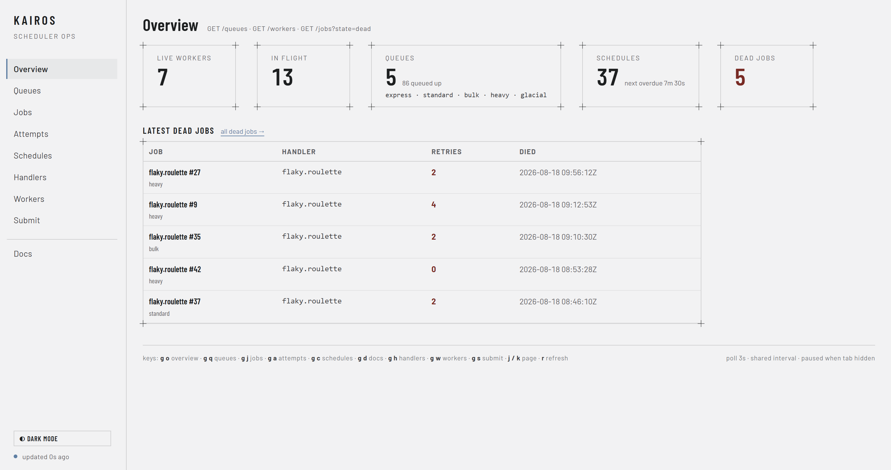

### Queues

Per-queue composition across `pending`, `queued`, `running` and `awaiting_retry`, alongside how
many workers are attached and what is still buffered in Redis. A queue with backlog and no worker
attached is visible at a glance.

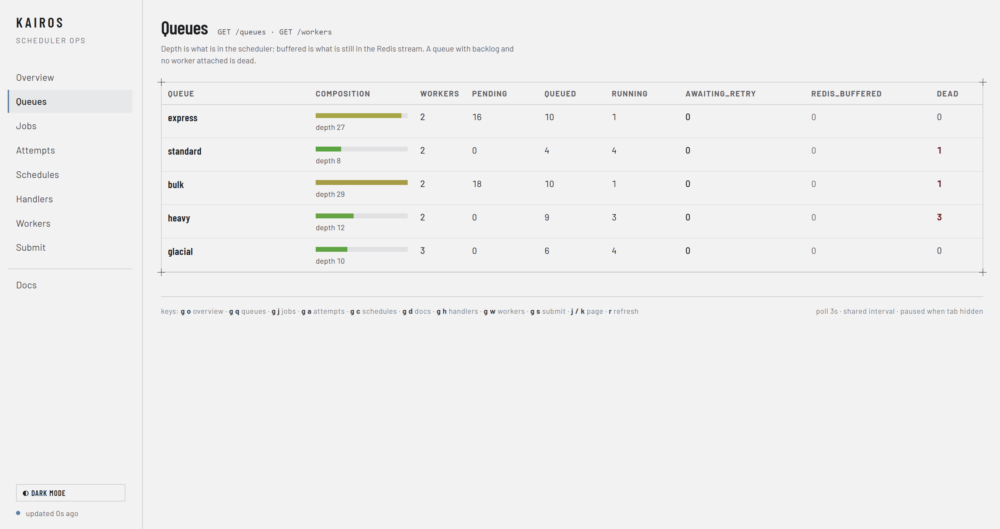

### Jobs

Filter by state (multi-select), type, queue and handler, or paste a job id straight into the
lookup. Expanding a row shows that job's attempts inline without leaving the list.

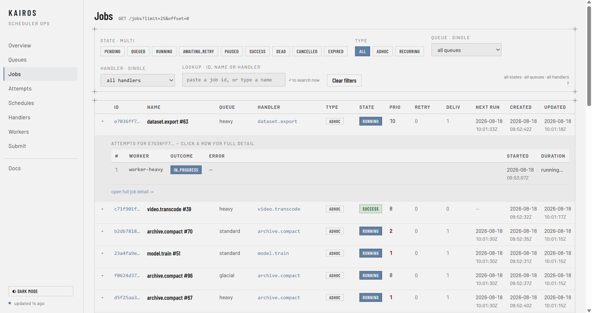

### Job detail

The full record for one job: state, priority, both counters, the schedule window if it has one,
and tabs for payload, attempt history and log lines. Pause, Reschedule, Cancel and Rerun are here
too, each greyed out when the job's current state does not allow it. This is the "why did this
fail four times" view.

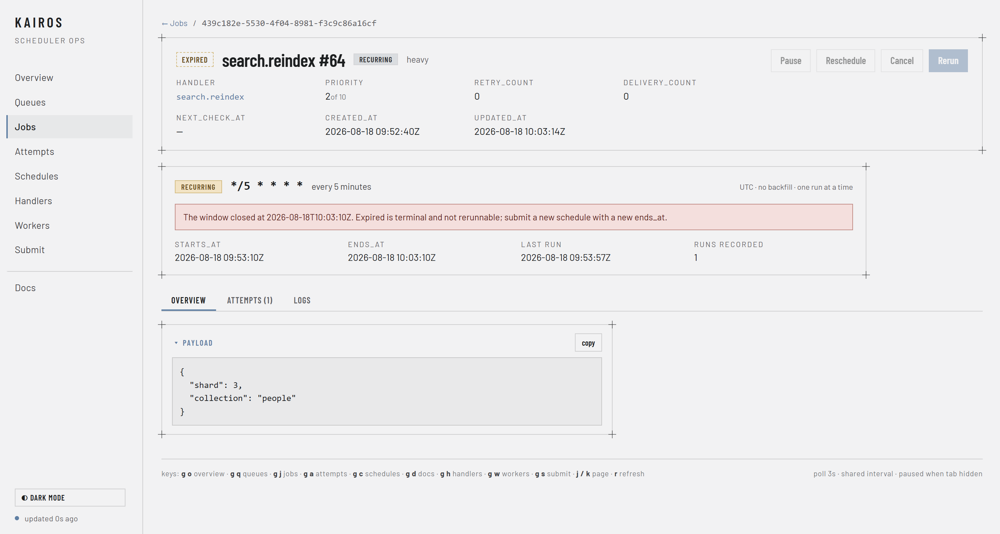

### Attempts

Every execution attempt across every job, newest first, filterable by outcome. Duration, worker
and the returned result or error are on the row, so a `failed` and a `lost` attempt are
distinguishable at a glance.

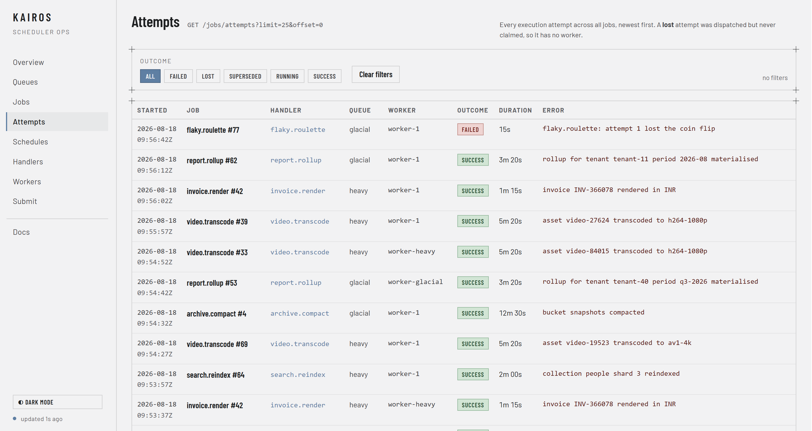

### Schedules

One row per cron job, showing the expression in plain language, the last and next fire times, the
`starts_at` / `ends_at` window and how many runs it has recorded, with a one-click pause.

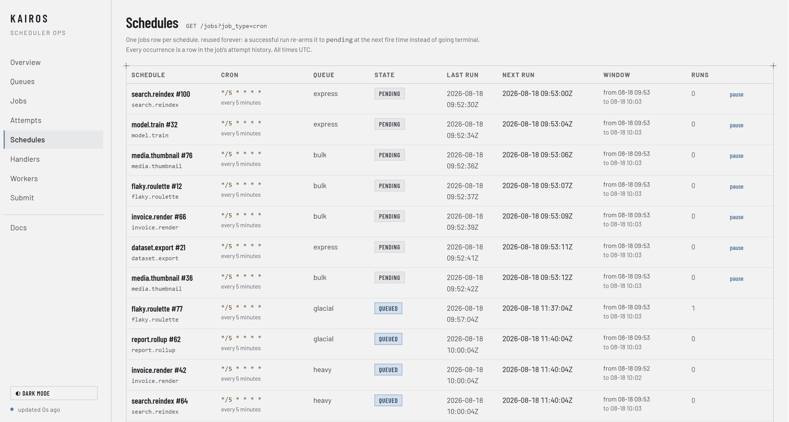

### Handlers

Per-handler jobs, backlog, running, retrying and dead counts, plus success rate and average run
time. Sort by dead to find the code that keeps exhausting its retries.

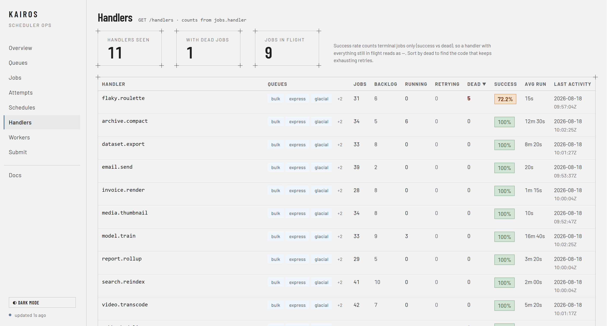

### Workers

The live registry straight out of Redis: which queues each worker serves, what it is executing
right now, how long that job has been running, and when it was last seen.

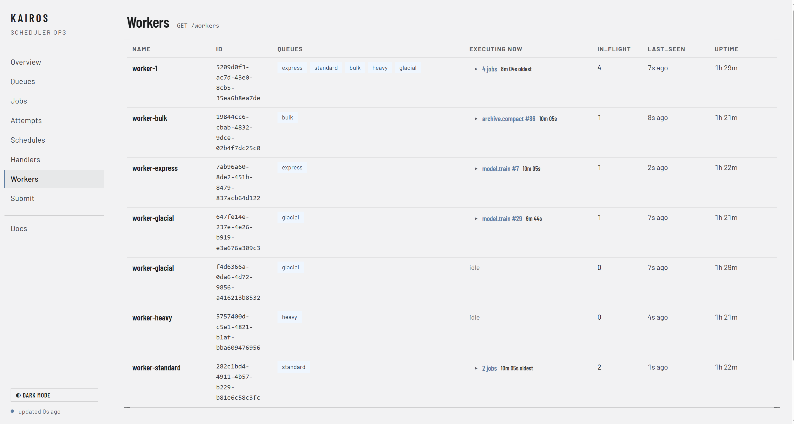

## Scaling

| Process | Instances | Why |
| --- | --- | --- |
| worker | any | `ClaimJobForExecution` requires `state = 'queued'` and bumps `version`, so only one worker can ever win a job; losers pop the id and drop it |
| api | any | stateless: Postgres and Redis reads plus version-guarded writes, no background loops |
| **consumer** | **exactly 1** | `GetDueJobs` is a plain `SELECT` with no `SKIP LOCKED` and no leader election; two consumers would read the same due rows and both `LPUSH` them, inflating `delivery_count` on wasted duplicate pops |

Add workers by starting more processes; there is no registration step. Identity is
`<name>:<run-uuid>`, and the uuid is per-process, so reusing a `-name` will not collide; it will
only make two instances indistinguishable in `/api/v1/workers`. Give each a distinct name.

Consumer throughput is tuned with `queue_limit` and `poll_interval`, not with instance count.

## Roadmap

- **Go client library.** A typed client over the HTTP API, so submitting and inspecting jobs
  from another Go service does not mean hand-rolling requests. Landing very soon; the `client/`
  package is already reserved for it.
- **MCP server.** Exposes queues, jobs, attempts and logs as MCP tools, so an agent can inspect a
  backlog, read why a job failed, and rerun a dead job without a human in the dashboard. Also
  landing very soon.
- Multi-instance dispatch (`SELECT ... FOR UPDATE SKIP LOCKED`), to remove the single-consumer
  ceiling.
- Prometheus metrics, labelled by queue and never by job id.

## Known limitations

- **No automated test suite yet.** There are no `*_test.go` files in the repository and no CI is configured.
- **The consumer is a single-instance ceiling.** See [Scaling](#scaling); throughput is tuned by config, not by adding consumer instances.
- **`GET /jobs` pagination is plain offset-based** (`LIMIT` / `OFFSET` ordered by `updated_at DESC`), so a page can shift if rows are updated between two requests.
- **There is no ordering guarantee between jobs.** Priority and aging shape dispatch order, not execution order.
- **The dashboard's Docs page is a stub.**
- **`scripts/dev.ps1`'s dashboard dev-server step is stale.** `web/` is empty; the UI moved into `internal/dashboard/assets` and is embedded in the `api` binary.

## Gotchas

- **The consumer must be running.** It is the only path from Postgres to Redis; without it, jobs sit in `pending` forever.
- **A job's first delivery usually loses its claim,** adding roughly one `claim_deadline` to its latency; see [Lost dispatch](#lost-dispatch). The job is not lost: it records a `lost` attempt, returns to `pending`, and succeeds on the next delivery.
- **`brpop_timeout` below 1s is pointless.** Redis `BRPOP` has one-second granularity; go-redis truncates smaller values and logs a warning on every call.
- **Build pools with `kairos.New`,** not a hand-rolled `pgxpool`; connection setup is more than a DSN.
- **Handlers must respect `ctx`.** It is cancelled when a claim is lost; ignoring it means two workers can end up doing the same work.
- **Timestamps read straight from the repository layer** (for example `db.Job.CreatedAt.Time`) carry the host's local zone, since pgx decodes `timestamptz` into `time.Local`. The instant is correct; call `.UTC()` before formatting. The API layer already does.
- **Control flow inside `<table>` and `<select>` in the dashboard templates must use the attribute form** (`sc-for` / `sc-as` / `sc-if`), never a custom element. The HTML parser foster-parents an unknown element out of a table and drops it inside a select, silently collapsing a loop to one blank row.

## License

MIT. See [LICENSE](LICENSE).
